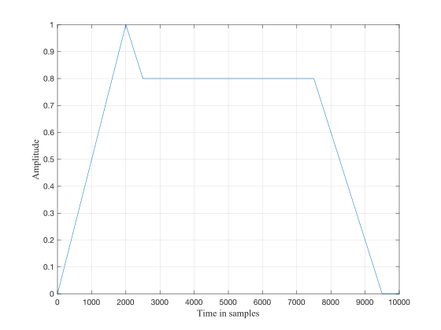
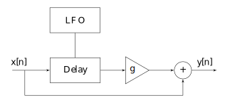

# Chapter 1: Introduction
Digital sound processing is the discipline where signals are manipulated in software through different operations. 
All these operations will be explained and implemented using Faust.

##What is sound?
Sound is a form of energy, created when air molecules propagate in patterns called waves. Such waves of rapidly varying pressure are caused by vibrating objects. As an example, when a person plucks a guitar string, as the string moves in one direction, it pushes on nearby air molecules, causing them to move closer together. This creates a small region of high pressure on one side of the string and low pressure on the opposite side. As the string moves in the opposite direction, the areas of high and low pressure reverse. This compression and rarefaction of air molecules occurs periodically.
The frequency $f$ of a sound is defined as the number of oscillations per second. It is measured in Hertz (abbreviated as Hz). The amplitude of a sound, measured in decibel (db), represents the size of such variations.
Sound waves are captured by using a transducer such as a microphone. A microphone converts acoustical waves into electrical waves.
Figure 1 shows a sinewave or sinusoid in time domain, i.e., in a time versus amplitude axes, in the bottom part. The frequency of this sinewave is 2.5 Hz. The sinewave is a periodic wave, which means that it regularly repeats over time.
The period is given by $ 1 / f$.

Figure 1 shows a sinewave in time domain.

Figure 1: time domain representation of a sinewave.


A frequency domain or spectrum representation shows the frequency content of a sound versus the amplitude. The individual frequency components are called harmonics (if they are integer multiple of the fundamental frequency) or partials.
Figure XX shows the spectrum of the same sinusoid.


When representing a sound digitally, the soundwave is sampled at
regular intervals by using an analog to digital converter (ADC),
which produces numbers which represent the value of each sample.

The sampling rate is defined as the number of samples per seconds.
As an example, to obtain compact disc quality the sampling rate is
set to 44.100 Hz, or 44.1 kHz. This means that each second of sound
is represented by 44.100 samples.

When the goal is to listen to a digitally reproduced sound, the
operation called digital to analog conversion (DAC) needs to be
performed. A digital to analog converter reconstructs the sound from
its samples. Computer sound cards have both ADC to input sounds and
DAC to output them.


# Chapter 2: Introduction to sound synthesis

In the previous chapter we have learned how to represent sounds digitally, and how a sinewave is represented.
In this Chapter we will learn how to create sounds in software using different synthesis techniques.
We start with techniques which combine sinewaves together in different ways.

## Additive synthesis

Additive synthesis is based on the principle that any complex waveform can be created by summing a finite number of sinewaves. This idea derives from the Fourier theorem, which states that any complex sound can be decomposed as the sum of its elementary components, which are sinewaves (also called sinusoids or pure tones).
As an example, Figure 1 shows the time and frequency domain representation of a square wave. The diagram on the center represents the time domain (top) and frequency domain (bottom) or spectrogram of a square wave.
The diagram on the right side shows what is known as spectrogram. The spectrogram is a representation time versus frequency of a signal. The amplitude is represented by the greyscale in which the wave is represented. The darker the mark, the higher the amplitude at that specific frequency.

Figure XX shows the block diagram of an additive synthesizer. In it, four sinewaves are summed together.


TODO: figure needs to be redone


# Faust Codes

## Additive Synthesizer

<!-- faust-run -->
```
import("stdfaust.lib");

addSynth(f) = par(i,N,oscillator(i)) :> /(N)
with{
  N = 4; // number of iterations
  oscillator(i) = os.osc(f*fRatio)
  with{
	fRatio = hgroup("[0]Add Synth",vslider("Freq Ratio %i",1+i,1,10,0.01));
  };
};

// "MIDI" Parameters
freq = hslider("[1]freq",440,50,2000,0.01);
gain = hslider("[2]gain",1,0,1,0.01);
gate = button("[3]gate");

process = addSynth(freq)*gain*gate;
```
<!-- /faust-run -->			

`N` changes the number of oscillators...


##Amplitude envelopes

An amplitude envelope determines how the amplitude of a sound evolves over time.
In the following we analyze several amplitude envelopes used in sound processing.

### ADSR Envelope

A typical example of amplitude envelopes is the so-called ADSR envelope, which stands for Attack, Decay, Sustain and Release.
A schematic structure of an ADSR envelope is shown in Figure XXX.




## Decaying Exponential

Not really sure how you wanted to implement this, but that seemed like a good
way to do it... :)

<!-- faust-run -->
```
import("stdfaust.lib");

exDecEnv(t60,gate) = gate : normOnePole(pole)
with{
  normOnePole(s) = *(1.0 - s) : + ~ *(s);
  pole = exp(-1.0/(t60*ma.SR));
};

freq = hslider("[1]freq",440,50,2000,0.01);

envelope = hgroup("[2]Envelope",exDecEnv(t60,gate)*gain)
with{
  t60 = hslider("[0]t60[style:knob]",0.1,0.001,5,0.001);
  // "MIDI" Parameters
  gain = hslider("[1]gain[style:knob]",1,0,1,0.01);
  gate = button("[2]gate");
};

process = os.sawtooth(freq)*envelope;		
```
<!-- /faust-run -->	

## ADSR With Exponential Segments

Example of ADSR envelope with exponential segments applied to a sawtooth wave
oscillator.

<!-- faust-run -->
```
import("stdfaust.lib");

adsre(attT60,decT60,susLvl,relT60,gate) = envelope with {
  ugate = gate>0;
  samps = ugate : +~(*(ugate)); // ramp time in samples
  attSamps = int(attT60 * ma.SR);
  target = select2(ugate,0.0,select2(samps<attSamps,susLvl*float(ugate),ugate));
  t60 = select2(ugate,relT60, select2(samps<attSamps,decT60,attT60));
  pole = ba.tau2pole(t60/6.91);
  envelope = target : si.smooth(pole);
};

freq = hslider("[1]freq",440,50,2000,0.01);

envelope = hgroup("[2]Envelope",adsre(att,dec,gain,rel,gate))
with{
  att = hslider("[0]Attack[style:knob]",1,0.001,5,0.001);
  dec = hslider("[1]Decay[style:knob]",1,0.001,5,0.001);
  rel = hslider("[2]Release[style:knob]",1,0.001,5,0.001);
  // "MIDI" Parameters
  gain = hslider("[3]gain[style:knob]",1,0,1,0.01);
  gate = button("[4]gate");
};

process = os.sawtooth(freq)*envelope;	
```
<!-- /faust-run -->	

## Distortion

<!-- faust-run -->
```
import("stdfaust.lib");

cubicnl(drive,offset) = *(pregain) : +(offset) : clip(-1,1) : cubic
with {
  pregain = pow(10.0,2*drive);
  clip(lo,hi) = min(hi) : max(lo);
  cubic(x) = x - x*x*x/3;
};

drive = hslider("[0]Drive[style:knob]",0.5,0,1,0.01);
offset = hslider("[1]Offset[style:knob]",0,-1,1,0.01);

process = hgroup("Distortion",cubicnl(drive,offset));
```
<!-- /faust-run -->				

We could improve this by adding a DC blocker too.

## Compressor

TODO: this one hasn't been tested but it seems to work. We should talk about 
how deep we wanna go in terms of not using pre-written functions. All in all,
it seems that we can't just through Faust examples at student's face: it needs
to be contextualized and build up progressively.

<!-- faust-run -->
```
import("stdfaust.lib");

compressor(ratio,thresh,att,rel,kneeAtt,gain) = _ <: _*(ampFollower(att,rel) : 
  ba.linear2db : outminusindb : kneesmooth : visualizer : ba.db2linear)*gain 
with{
  normOnePole(p,x) = x * (1.0 - p) : (+ : max(x,_)) ~ *(p);
  attPole = ba.tau2pole(att);
  relPole = ba.tau2pole(rel);
  kneePole = ba.tau2pole(kneeAtt);
  ampFollower(att,rel) = abs : normOnePole(attPole) : normOnePole(relPole);
  outminusindb(level) = max(level-thresh,0)*(1/ratio-1);
  kneesmooth = normOnePole(kneePole);
  visualizer = hbargraph("[1]Compressor Level [unit:dB]",-50,10);
};

envelopesGroup(x) = hgroup("[0]Envelope",x);
att = envelopesGroup(hslider("[0]Attack [style:knob][unit:ms]",20,0,500,0.1)*0.001);
rel = envelopesGroup(hslider("[1]Release [style:knob][unit:ms]",20,0,500,0.1)*0.001);
kneeAtt = envelopesGroup(hslider("[2]Knee Attack [style:knob][unit:ms]",10,0,250,0.1)*0.001);
thresh = hslider("[2]Threshold [unit:dB]",-30,-60,4,0.1);
ratio = hslider("[3]Ratio",1,1,10,0.01);
makeUpGain = hslider("[4]Makeup Gain [unit:dB]",40,-96,96,0.1) : ba.db2linear;

process = vgroup("Compressor",compressor(ratio,thresh,att,rel,kneeAtt,makeUpGain));
```
<!-- /faust-run -->	


## Granular synthesis

A grain of sound can be defines as a brief acoustical event, with a duration near the treshold of human perception (usually between 10 and 60 ms). 
The idea behind granular synthesis is the creation of complex sound events by combining several grains of sound over time. In granular synthesis, a grain of sound is therefore considered as a building block for the creation of more complex sonic events.

The idea of having sound grains was proposed by the British physicist Dennis Gabor in 1947. Gabor suggested the idea of a quantum of sound, as a perceptual indivisible unit of information. All macro-level phenomena are based on the sound quantum.
Granular synthesis was first suggested as a computer music technique for producing complex sounds by Iannis Xenakis and Curtis Roads.
Granular synthesis is based on the production of a high density of small acoustic events called grains that are typically in the range of 10-60 ms.
To enable smooth transitions between grains, each grain has an amplitude envelope. In Gabor’s original conception, the amplitude envelope is a bell shaped curve generated by the Gaussian method.

###Parameters of granular synthesis
The control parameters of a granular synthesizer are the following:

####Grain size:
 length of the grain in milliseconds.
#### Grain shape. 
The grain itself may come from a sinewave, pulse wave, synthesis techniques such as FM synthesis or sampled sounds.

####Envelope shape.
Envelope shape is the shape of the amplitude envelope of each individual grain
####Grain spacing over time.
Grain spacing is the distance between grain over time. 
####Grain density: 
Grain density number of grains per unit of time.
Typical grain densities range from several hundred to several thousand grains per second.
#### High-level grain organization
When organized over time, grains can be placed in a synchronous or asynchronous way.

#### Synchronous granular synthesis
In synchronous granular synthesis, grains are placed at equally spaced positions. This creates a periodicity which provides a sensation of frequency. For example, if grains are placed every 10 ms, a 100 Hz frequency will be heard.
This technique is designed for the synthesis of tones with one or more resonances, e.g., suitable for imitating musical instruments or the human voice.

#### Asynchronous granular synthesis
In asynchronous granular synthesis, grains are scattered randomly over a user-determined duration and with user-determined density and frequency content (depending on the waveform used in the grains).
### Implementation
Granular synthesis can be implemented generating small sound events and placing them over time as if in a score. Lots of parameters are involved. Their choice and organisation is what makes granular synthesis more or less interesting.

#### Time stretching
In synchronous granular synthesis, it is possible to create time stretching effects by repeating the grains is a longer (or shorter) amount of time, without varying their distance.
#### Pitch shifting
In synchronous granular synthesis, it is possible to create pitch shifting effects by changing the space between the grains.


# Chapter 3: Modulation Synthesis

In this Chapter we will explain some classic modulation techniques.
Modulation is the alteration of the amplitude, frequency and /or phase of an 
oscillator in accordance with another signal. The original oscillator is called 
the carrier signal, while the modulating signal is called the modulator signal.
In this Chapter we will examine three forms of modulations: Ring Modulation (RM), 
Amplitude Modulation (AM), and Frequency Modulation (FM).

## Ring modulation

Ring modulation is simply the multiplication of two signals. Ring modulation 
has been extensively used by the German composer [Karlheinz Stockhausen](TODO). 
It is also found in the implementation of the first movie completely 
designed with electronic sounds: [Forbidden Planet](TODO) (1956). Ring 
modulation is also extensively present in video games. As an example, the 
sound chip of [Commodore 64](TODO) had ring modulation implemented, which was 
used in sound effects for several games.
<!-- RM: that's a lot of "been used..." -->
<! fixed ...grrrrr !>

The algorithm of ring modulation can be summarized as follows:

TODO: insert ring mod diagram here

In order to understand what happens to the spectrum of a sound when we 
multiply two signals, let’s consider the simple case of multiplying two 
cosinewaves:

$$y(t) = \cos(\omega_1 t) \cos (\omega_2 t)$$ 

<!-- Why cosine and not sine? -->
<! --- why not? -----ok I change it!>

where $\omega_1$ and $\omega_2$ represent the frequencies of two sinewaves.

Using trigonometric identities, the following equation holds:

$$y(t) = \sin(\omega_1 t) \sin (\omega_2 t) = \frac {1}{2}[ \cos((\omega_1-\omega_2)  t)) -  \cos((\omega_1+ \omega_2)  t))$$ 

Usually one of the frequency components is called the carrier frequency, while the other is called modulation frequency.
These two sinusoidal components created at the sum and difference frequencies of the modulator and carrier are called sidebands.
Ring modulation produces two sidebands.

A Faust implementation of the previous equation could be:

<!-- faust-run -->
```
import("stdfaust.lib");
f1 = hslider("f1",300,20,1000,0.1);
f2 = hslider("f2",100,20,1000,0.1);
process = os.osc(f1)*os.osc(f2);
```
<!-- /faust-run -->		

Note that the modulation could be applied to any input signal simply by making 
the following modification:

<!-- faust-run -->
```
import("stdfaust.lib");
modFreq = hslider("Modulation Frequency",300,20,1000,0.1);
process = *(os.osc(modFreq));
```
<!-- /faust-run -->		

### Tremolo Effect

Tremolo is defined as the variation of the amplitude of a signal. A tremolo 
effect can be obtained with a ring modulator, but having the frequency of the 
modulator signal below 20 Hz.

A Faust implementation of a simple tremolo effect could be:

<!-- faust-run -->
```
import("stdfaust.lib");
modFreq = hslider("Modulation Frequency",8,0.001,20,0.1);
process = *(os.osc(modFreq));
```
<!-- /faust-run -->		

<!-- RM: do we want to do some scaling on the signal of the sine oscillator to
prevent the phase inversion? If yes, should we comment that in the body of the
text and add some math? -->

## Amplitude Modulation

In the ring modulation equation the frequency of the carrier signal is not 
present anymore in the resulting sound. In order to avoid this, the ring 
modulation equation can be modified. Amplitude modulation is mathematically 
expressed as:

$$y(t) = \cos(\omega_1 t) (\cos (\omega_2 t)+1)$$ 

Using again trigonometric identities, the result of such multiplication 
becomes:

$$y(t) =  \frac {1}{2}[ \cos((\omega_1-\omega_1)  t)) +  \cos((\omega_1+ \omega_1)  t)) + \cos(\omega_1 t) $$ 

The corresponding Faust implementation could be:

<!-- faust-run -->
```
import("stdfaust.lib");
f1 = hslider("f1",300,20,1000,0.1);
f2 = hslider("f2",100,20,1000,0.1);
process = os.osc(f1)*(os.osc(f2)+1)*0.5;
```
<!-- /faust-run -->		

Note that the whole process must be multiplied by 0.5 here to restrain the
range of the generated signal between -1 and 1 to prevent clicking.

## Frequency Modulation

Frequency modulation (FM) is a synthesis technique 
[invented by John Chowning](#chowning-fm) at Stanford University in California.

The FM patent was licensed from Stanford University to Yamaha, and allowed the 
creation of the [DX7](TODO), the most successful synthesizer in history.
FM synthesis was the most popular synthesis techniques in the 80s, especially 
for its ability to create several complex sounds with very little computational 
power.

The main idea behind frequency modulation is the fact that the frequency of a 
carrier oscillator can be modulated by another oscillator. Mathematically 
speaking, given two cosine waves:

$$
y_1(t) = a_1 \cos(\omega_1 t) \\
y_2(t) = a_2 \cos(\omega_2 t)
$$

FM can be expressed as:

$$y = \cos((\omega_1 + a_2 cos (\omega_2 t)) t)$$

<!-- RM: where did a1 go? -->

The corresponding Faust implementation could look like:

<!-- faust-run -->
```
import("stdfaust.lib");
f1 = hslider("[0]f1",300,20,1000,0.1);
a1 = hslider("[1]a1",1,0,1,0.01);
f2 = hslider("[2]f2",100,20,1000,0.1);
a2 = hslider("[3]a2",1,0,100,0.01);
process = a1*os.osc(f1 + a2*os.osc(f2));
```
<!-- /faust-run -->	

This equation therefore represents a cosine wave whose frequency is modulated 
by another cosine wave. The result is a very complex spectrum able to generate 
not only a few sidebands like amplitude and ring modulation, but an infinite 
number of sidebands.

<!-- RM: I don't think we mentioned the concept of sidebands in the AM section,
I think we should. -->

More precisely, John Chowning discovered that with frequency modulation it is 
possible to produce sidebands given by the following equation:

$$
\omega_s = \omega_c \pm n \omega_n
$$

where $n$ is an integer, $\omega_c$ is the carrier's frequency and $\omega_n$ 
is the modulation frequency.

<!-- wm or wn? ;) -->
<! fixed !>

This equation simply expresses the fact that each sideband lies at a frequency 
which is equal to the carrier frequency plus or minus an integer multiple of 
the modulator frequency.

In theory, since $n$ can take any integer value, applying frequency modulation 
produces an infinite series of sidebands. In practice this is not the case, as 
we will see later.

The calculation of the amplitude of sidebands is a quite complex task. We need 
to introduce a new term named $\beta$, known as the modulation index. In the 
frequency modulation equation, $\beta$ represents $a_2$, the amplitude of the 
modulator. $\beta$ is defined as:

$$
\beta = \frac {\Delta \omega_c}{\omega_n}
$$

where $\Delta \omega_c$
is the variation of the carrier frequency (the amount of variations of the carrier frequency from its unmodulated frequency).

### Bandwidth

The bandwidth of a signal can be defined as the range of frequencies occupied 
by a given signal. For example, a signal composed by two sinusoids, one at 
100 Hz and one at 200 Hz has a bandwidth of 100 Hz. On the other hand, a signal 
composed by the sum of two sinusoids, one at frequency 100 Hz and another at 
frequency 400 Hz has a bandwidth of 300 Hz.

**Exercise:** Two cosine waves at frequencies 300 Hz and 500 Hz are 
ring-modulated. What is the bandwidth of the resulting signal? For frequency 
modulation, there is a rule of thumb which states the following:

$$ B = 2 \omega_m (1 + \beta) $$

### The C:M Ratio

The C:M ratio expresses the relative frequencies of carrier and modulator 
signal. An an example, if the carrier frequency is 200 Hz and the modulator 
frequency is 100 Hz, then the C:M ratio is 2.

The previous Faust example could be modified to reflect this change:

<!-- faust-run -->
```
import("stdfaust.lib");
f1 = hslider("[0]f1",300,20,1000,0.1);
a1 = hslider("[1]a1",1,0,1,0.01);
cm = hslider("[2]CM",1,1,10,0.1);
a2 = hslider("[3]a2",1,0,100,0.01);
process = a1*os.osc(f1 + a2*os.osc(f1*cm));
```
<!-- /faust-run -->	

In frequency modulation, for any given carrier frequency the frequencies of the 
upper sidebands lie at C+M, C+2M, C+3M,..and so on, while the lower sidebands 
lie at C-M,C-2M, and so on.

Lets consider the example in which C:M = 1:1. Let’s assume that both carrier 
and modulator frequency are placed at 100 Hz. This means that the upper 
sidebands will be at 200 Hz, 300 Hz, 400 Hz, and so on, while the lower 
sidebands will be at 0 Hz, -100 Hz,...and so on.

*What does the concept of a negative frequency mean?* A negative frequency is 
equivalent to its corresponding positive frequency, but remapped to the 
positive axes. When summing the same negative and positive frequency, if they 
have the same amplitude they will cancel each others.

In FM synthesis the amplitude of the sidebands is not the same, so the issue of 
cancellation of sidebands does not occur. In the case of FM synthesis, the 
calculation of the amplitude of each sideband requires the use of 
[Bessel functions](TODO).

<!-- RM: I think this section could be a little bit more developed (e.g., do
your students know what Bessel functions are?). It'd be nice to have some
spectra figures, etc. -->

## Musical examples

To be written.


#Chapter 4: Filters
According to Professor and DSP guru Julius Smith, everything is a filter. As a matter of fact, a filter is any operation that takes an input signal, performs some manipulations, and produces an output signsl.

##Simplest lowpass filter
The simplest lowpass filter is given by the difference equation:
$$
y[n] = x[n] + x[n-1] 
$$
As can be seen from the equation, the filter simply sums the current input sample and the previous input sample.

#Chapter 5: Delay based effects
## Basic delay
A basic delay simply plays an input sound after a specific amount of time.
Mathematically speaking, a delay can be expressed as:
$$y[n] = x[n -N]$$
where $n$ represents the current time in samples and $N$ represents the delay time in samples.


The delay is an essential building block for several other effects such as echo, reverb, chorus, flanging, as well as waveguide based simulations of musical instruments.

### Echo

When mixing the delayed output with the original input, we obtain an echo effect.
Specifically, and echo effect is given by:

$$y[n] = x[n] + g x[n -N]$$

where $N$ is the delay of the signal, typically in the range of $10$ to $50$ ms, and  $g$ is the gain, $( g <1)$, since the delayed signal is attenuated. A physical interpretation of $g$ is propagation losses of sound in air.

### Feedback delay
The simple feedforward echo shown in the previous example has limited applications, since it produces only a single echo.
Adding feedback allows to obtain a potentially infinite number of echoes.
The difference equation in this case becomes:
$$
y[n] = x[n] + g y[n - M]
$$
where $M$ is the length of the feedback delay in samples and $g$ represents the gain, $ g <1$.

### Flanger
A flanging effect is obtained when a signal is mixed with a slightly delayed copy of itself. The length of the delay line changes constantly.
The flanger effect resembles an echo effect, but with shorter delay time (typically $1 to 10$ ms).

The difference equation of a flanger effect is:
$$
y[n] = x[n] + g x[n - M(n)]
$$
where $x[n]$ represents the input signal, $y[n]$ the output signal, $g$ the depth of the flanging effect and $M(n)$ the length of the delay line at sample $n$.
In order to obtain a flanger effect, $M(n)$ varies smoothly over time.

<! Note Stefania: we need to introduce interpolated delay lines....here or later? -!>


###LFO


### Chorus
In real life a chorus is a group of singers performing together.
When for example two people perform together, they will have some small variations in the pitch and timbre of their voices, as well as small temporal variations.
As an analogy, a chorus effect is obtained by making one instrument sounding like many are playing together.
These small variations are obtained by modulating the original signal with time-varying short delays, as well as implementing detuning.




### Overdrive and clipping


### Doppler effect


#Chapter 6: Spatial sound


			
			
# References

<div id="chowning-fm">J. Chowning. The synthesis of complex audio spectra by 
means of frequency modulation. Journal of the Audio Engineering Society, 
21(7):526–534, 1973.</div> 

 
      