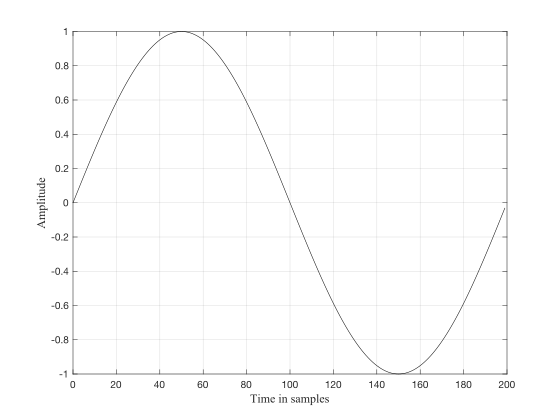

# Chapter 1: Introduction
Digital sound processing is the discipline where digital signals are manipulated through different operations. 
All these operations will be explained and implemented using Faust.

##What is sound?
Sound is a form of energy, created when air molecules propagate in patterns called waves. Such waves of rapidly varying pressure are caused by vibrating objects. As an example, when a person plucks a guitar string, as the string moves in one direction, it pushes on nearby air molecules, causing them to move closer together. This creates a small region of high pressure on one side of the string and low pressure on the opposite side. As the string moves in the opposite direction, the areas of high and low pressure reverse. This compression and rarefaction of air molecules occurs periodically.
The frequency $f$ of a sound is defined as the number of oscillations per second. It is measured in Hertz (abbreviated as Hz). The amplitude of a sound, measured in decibel (db), represents the size of such variations.
Sound waves are captured by using a transducer such as a microphone. A microphone converts acoustical waves into electrical waves.
Figure 1 shows a sinewave or sinusoid in time domain, i.e., in a time versus amplitude axes, in the bottom part. The frequency of this sinewave is 2.5 Hz. The sinewave is a periodic wave, which means that it regularly repeats over time.
The period is given by $ 1 / f$.

Figure 1 shows a sinewave in time domain.

Figure 1: time domain representation of a sinewave.

A frequency domain or spectrum representation shows the frequency content of a sound versus the amplitude. The individual frequency components are called harmonics (if they are integer multiple of the fundamental frequency) or partials.
Figure XX shows the spectrum of the same sinusoid.

When representing a sound digitally, the soundwave is sampled at
regular intervals by using an analog to digital converter (ADC),
which produces numbers which represent the value of each sample.

The sampling rate is defined as the number of samples per seconds.
As an example, to obtain compact disc quality the sampling rate is
set to 44.100 Hz, or 44.1 kHz. This means that each second of sound
is represented by 44.100 samples.

When the goal is to listen to a digitally reproduced sound, the
operation called digital to analog conversion (DAC) needs to be
performed. A digital to analog converter reconstructs the sound from
its samples. Computer sound cards have both ADC to input sounds and
DAC to output them.

## Additive synthesis

Additive synthesis is based on the principle that any complex waveform can be created by summing a finite number of sinewaves. This idea derives from the Fourier theorem, which states that any complex sound can be decomposed as the sum of its elementary components, which are sinewaves (also called sinusoids or pure tones).
As an example, Figure 1 shows the time and frequency domain representation of a square wave. The diagram on the center represents the time domain (top) and frequency domain (bottom) or spectrogram of a square wave.
The diagram on the right side shows what is known as spectrogram. The spectrogram is a representation time versus frequency of a signal. The amplitude is represented by the greyscale in which the wave is represented. The darker the mark, the higher the amplitude at that specific frequency.

Figure XX shows the block diagram of an additive synthesizer. In it, four sinewaves are summed together.

##Amplitude envelopes
An amplitude envelope determines how the amplitude of a sound evolves over time.
A typical example of amplitude envelopes is the so-called ADSR envelope, which stands for Attack, Decay, Sustain and Release.
A schematic structure of an ADSR envelope is shown in Figure XXX.

